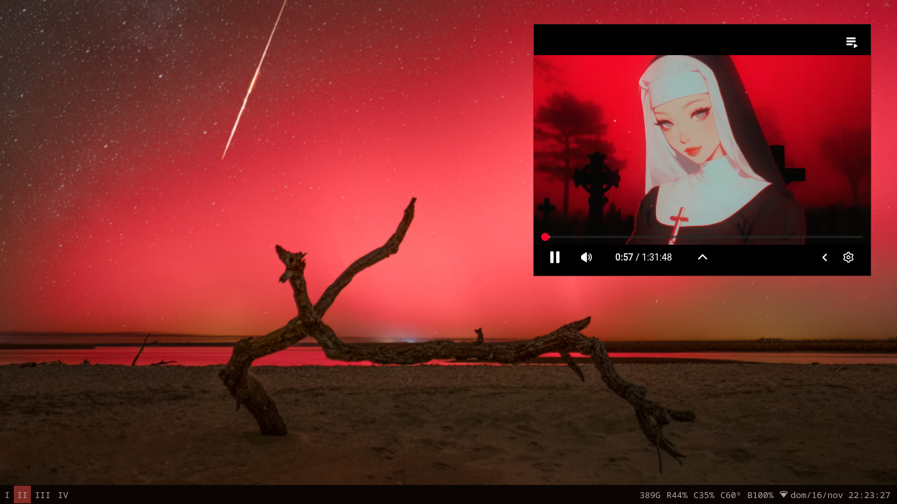

<div align="center">
  <h1>i3 Starship dotfiles</h1>
</div>

<div align="center">
  <picture>
    <source srcset="https://i.postimg.cc/bNdvdsWT/presentation.png" type="image/gif">
    
  </picture>
</div>

<div align="center">
  <sub><i>Casual, minimal, and simple environment with a space toast.</i></sub>
</div>

---

_Ready to code. Ready to stay chill._ \
_And yes, every day, the [Astronomy Picture of the Day][astropix] sets your wallpaper and your system theme._

[astropix]: https://apod.nasa.gov/apod/astropix.html

## Requirements ⚡

- [EndeavourOS i3](https://endeavouros.com/)

## Ready, Set, Launch 🚀

Run this command to set up or update the dotfiles on your system:

```sh
bash <(curl -s https://raw.githubusercontent.com/lucasvazq/dotfiles/main/setup.sh)
```

## Post-Installation Steps 🛰️

1. Reboot your system.

2. Configure Git & GitHub:

```sh
gh auth login --hostname github.com --git-protocol ssh --web
git config --global user.name "<YOUR_NAME>"
git config --global user.email "<YOUR_EMAIL>"
git remote set-url origin git@github.com:lucasvazq/dotfiles.git
ssh-keyscan github.com >> ~/.ssh/known_hosts
```
