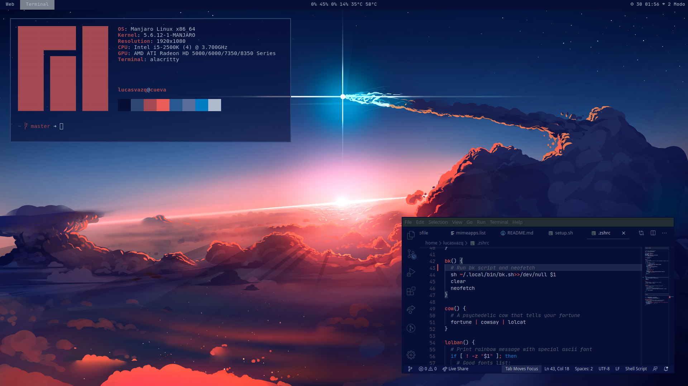

<span align="center">

# Minimalistic i3 Starship dotfiles
</span>


<p align="center">

  
</p>

When a new day starts, the [Astronomy Picture of the Day][astropix] is selected as your new wallpaper.
Based on the colors of this image, the general color scheme of the rest of the components of your ship was established.
I've improved it for Python hunting, while the command center is built with Vscode, the database is handled by psqalien and communications are done with Octocat and Heroku.

[astropix]: https://apod.nasa.gov/apod/astropix.html

🧲 ⚡ **Requirements:** Manjaro I3

## Ready, Set, Launch 🚀

Run the following commands
```sh
cd && git clone git@github.com:lucasvazq/dotfiles && cd dotfiles # Positionate and download the repo
./setup.sh # Start launch
shutdown -r now # Restart the system
```

After rebooting, there are other commands you should run on the fly

**Establish the communication channel with Octocat and Heroku**
```sh
heroku login
git config --global user.name "YOUR_NAME"
git config --global user.email "YOUR_EMAIL"
```
[Add SSH key][github_ssh_key_help]

[github_ssh_key_help]: https://help.github.com/es/github/authenticating-to-github/adding-a-new-ssh-key-to-your-github-account

## Travel guide

### How to drive through the meteorites
_The idea of ​​this setup is based on the fact that I consider there are two different moments in which we develop things. The first moment is when we do it for personal enjoyment, far from any responsibility that commits third parties. This moment is associated with when we do it for pleasure and develop for the simple fact of developing._
_The second situation in which we can find ourselves developing is when we do it because we have a responsibility with a third party, that is, when we are doing a job._
_This is why it seemed appropriate to me to have two separate folders where the works we carry out are kept, depending on the situation we are in when we develop them._
_The works that we do as hobbies are stored in `~/Workspaces/H`, those that we carry out under responsibilities are located in `~/Workspaces/J`._
_Everything related with the command interpreter, that are related to the H folder, are stored in `~/Workspaces/.hrc`. Everything related to the other folder, in `~/Workspaces/.jrc`._

Considering the words above, there are a couple of things to know to approach this methodology:

- The **wgc** command allows us to directly clone a repository in one of these workspaces.
<br>An example usage is: `wgc h git@github.com:jackfrued/Python-100-Days.git`, this clones [Python-100-Days][python_100_days] repo into H folder.

[python_100_days]: https://github.com/jackfrued/Python-100-Days

- In `~/.zshrc` there is a function called **cleanworkspaces** which calls two functions that are located in `.jrc` and`.hrc`. These functions are intended to clear all the virtual env and env variables related to their workspaces. In other words, the function found in `.jrc` should remove all non-default variables and virtual envs that are activated with some function that the user runs when working with a particular repository located in `~/Workspaces/J/`. In conclusion, when **cleanworkspaces** is called, all environment variables and virtual spaces are cleaned, and the benefit we can obtan from this is when the use of this function is automated for when we want to change the environment in which we are developing.

### Command center manager

**Windows Manager**
```txt
Keybinds ($mod = Windows|Super|Mod4 key)

# Browser
$mod+F1                     Open Brave
$mod+Shift+F1               Open Google chrome

# Editor
$mod+F2                     Open VSCode

# Folder Manager
$mod+F3                     Open file browser
$mod+Shift+F3               Open file browser in root mode

# Keyboard layout
$mod+q                      Change keyboard to US style 🇺🇸
$mod+w                      Change keyboard to ES style 🇪🇦

# Terminal
$mod+Return                 Open terminal

# Audio
$mod+Ctrl+m                 Open audio effects

# App menu
$mod+d                      Open run menu
$mod+Shift+d                Open emoji menu
$mod+z                      Open apps menu

# Screenshot
Print                       Full screen screenshot
$mod+Shift+Print            Selectable area screenshot

# Windows Management
ARROWS: Up(k), Dowm(j), Left(h), Right(l)
$mod+Shift+q                Kill actual window
$mod+f                      Fullscreen mode for a window
$mod+Shift+<ARROWS>         Move window up|down|left|right
$mod+r                      Resize window
$mod+Shift+space            Toggle windows mode between tiling/floating
$mod+space                  Change focus between tiling/floating windows
$mod+Ctrl+space             Toggle split mode between horizontal and vertical
$mod+<ARROWS>               Focus window up|down|left|right
$mod+Ctrl+<Right(l)>        Next desktop workspace
$mod+Ctrl+<Left(h)>         Prev desktop workspace
$mod+<NUMBERS 1-9>          Switch to N desktop workspace
$mod+Ctrl+<NUMBERS 1-9>     Move window to desktop workspace N
$mod+Shift+<NUMBERS 1-9>    Move to N desktop workspace with actual container

# System mode
$mod+0                      Select ship mode
```

**Terminal commands**
```txt
# Weird things
bk                          Change background image and general color scheme.
                            Without args, it's setup a random image from
                            ~/Pictures/Wallpapers. Else, it's setup the image
                            your pass as argument
desc                        Print the description of the Astronomic Picture of the Day
fav                         Select preferred color schema
lolban                      Print a rainbow message
cow                         A psychedelic cow that tells your fortune
neo                         Take selfie from space

# Productivity
ed                          Open code editor
open                        Open link with the default browser
cud                         Change the timezone based on UTC. You can pass the
                            year, month, day, hour or minute. Otherwise, if you
                            don't pass any arguments, the time sets to auto
wgc                         Clone a repo in any of the workspaces
pk                          Kill a process running in a custom port

# Servers
drs                         Run Django server. You can specify the port
hl                          Run Heroku server. You can specify the port
ds                          Open Django shell. You can specify a db schema
hrs                         Open Django shell in a Heroku App. You can specify
                            a db schema
hrq                         Open PostgreSQL CLI in a Heroku App

# Python
pyc                         Create Python environment
pya                         Activate Python environment
pyl                         List all Python environments
pyr                         Remove Python environment
pyd                         Deactivate Python environment if any
```
