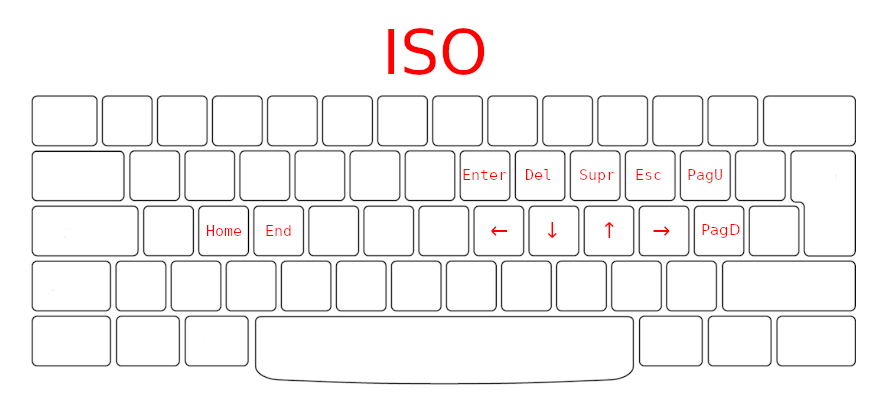

# VSCode Keyboard layout



## Index

1 - [Text editor](#text-editor)
1.1 - [Cursors and Selections](#cursors-and-selections)
1.2 - [Insert](#insert)
1.3 - [Delete](#delete)
1.4 - [Jumpy](#jumpy)
1.5 - [Bookmarks](#bookmarks)
1.6 - [Textmarker](#textmarker)
1.7 - [Groups](#groups)
1.8 - [Problems](#problems)
1.9 - [Suggestions](#suggestions)
1.10 - [References](#references)
1.11 - [Definitions](#definitions)
1.12 - [Refactorization](#refactorization)
2 - [Lists](#lists)
3 - [Search](#search)
4 - [Terminal](#terminal)
5 - [Panel](#panel)
6 - [Files](#files)
6.1 - [OS](#os)
6.2 - [Gistpad](#gistpad)

## Text editor

### Cursors and Selections
```yaml
# Left
cursorLeft:                                         Alt+j
cursorLeftSelect:                                   Ctrl+j
cursorWordStartLeft:                                Ctrl+Alt+j
cursorWordStartLeftSelect:                          Ctrl+Shift+j
cursorWordPartLeft:                                 Shift+Alt+j
cursorWordPartLeftSelect:                           Ctrl+Shift+Alt+j

# Right
cursorRight:                                        Alt+;
cursorRightSelect:                                  Shift+Alt+;
cursorWordStartRight:                               Ctrl+Alt+;
cursorWordStartRightSelect:                         Ctrl+Shift+;
cursorWordPartRight:                                Shift+Shift+;
cursorWordPartRightSelect:                          Ctrl+Shift+Alt+;

# Down
cursorDown:                                         Alt+k
cursorDownSelect:                                   Shift+k
editor.action.insertCursorBelow:                    Shift+Alt+k
editor.action.moveLinesDownAction:                  Ctrl+Alt+k
indentation-level-movement.moveDown:                Ctrl+Shift+k
indentation-level-movement.selectDown:              Ctrl+Shift+Alt+k

# Up
cursorUp:                                           Alt+l
cursorUpSelect:                                     Shift+l
editor.action.insertCursorAbove:                    Shift+Alt+l
editor.action.moveLinesUpAction:                    Ctrl+Alt+l
indentation-level-movement.moveUp:                  Ctrl+Shift+l
indentation-level-movement.selectUp:                Ctrl+Shift+Alt+l

# PageUp
cursorPageUp:                                       Alt+[
cursorPageUpSelect:                                 Shift+Alt+[

# PageDown
cursorPageDown:                                     Alt+'
cursorPageDownSelect:                               Shift+Alt+'

# Home
cursorHome:                                         Alt+s
cursorHomeSelect:                                   Shift+Alt+s

# End
cursorEnd:                                          Alt+d
cursorEndSelect:                                    Shift+Alt+d

# Exit
removeSecondaryCursors:                             Alt+p
cancelSelection:                                    Alt+p
```

### Insert
```yaml
editor.action.insertLineBefore:                     Shift+Alt+u
editor.action.insertLineAfter:                      Alt+u
```

### Delete
```yaml
editor.action.deleteLines:                          Ctrl+Shift+i

# Right
deleteRight:                                        Alt+o
deleteWordRight:                                    Ctrl+o
deleteWordEndRight:                                 Shift+Alt+o
deleteWordPartRight:                                Ctrl+Shift+Alt+o

# Left
deleteLeft:                                         Alt+i
deleteWordLeft:                                     Ctrl+i
deleteWordEndLeft:                                  Shift+Alt+i
deleteWordPartLeft:                                 Ctrl+Shift+Alt+i
```

### Jumpy
```yaml
extension.jumpy-enter:                              Alt+t
extension.jumpy-exit:                               Alt+t
```

### Bookmarks
```yaml
bookmarks.toggle:                                   Ctrl+q
bookmarks.listFromAllFiles:                         Ctrl+Alt+q
```

### Textmarker
```yaml
textmarker.toggleHighlight:                         Alt+h
textmarker.unhighlight:                             Shift+h
```

### Groups
```yaml
# Focus
workbench.action.keepEditor:                        Ctrl+k Alt+u
workbench.action.focusActiveEditorGroup:            Alt+,
workbench.action.previousEditorInGroup:             Ctrl+Alt+[
workbench.action.nextEditorInGroup:                 Ctrl+Alt+'

# Move
workbench.action.moveEditorLeftInGroup:             Ctrl+Shift+Alt+[
workbench.action.moveEditorRightInGroup:            Ctrl+Shift+Alt+'
workbench.action.moveActiveEditorGroupLeft:         Ctrl+k Alt+j
workbench.action.moveEditorToLeftGroup:             Ctrl+k Shift+Alt+j
workbench.action.moveActiveEditorGroupRight:        Ctrl+k Alt+;
workbench.action.moveEditorToRightGroup:            Ctrl+k Shift+Alt+;
```

### Problems
```yaml
editor.action.marker.next:                          Alt+n
editor.action.marker.prev:                          Shift+Alt+n
```

### Suggestions
```yaml
selectNextSuggestion:                               Alt+k
selectPrevSuggestion:                               Alt+l
acceptSelectedSuggestion:                           Alt+u
```

### References
```yaml
goToNextReference:                                  Alt+q
goToPreviousReference:                              Shift+Alt+q
closeReferenceSearch:                               Alt+p
```

### Definitions
```yaml
editor.action.revealDefinition:                     Alt+e
editor.action.peekDefinition:                       Ctrl+e
```

### Refactorization
```yaml
editor.action.rename:                               Alt+y
cancelRenameInput:                                  Alt+p
```

## Lists
```yaml
# Movement
list.focusDown:                                     Alt+k
list.focusUp:                                       Alt+l
list.focusPageUp:                                   Alt+[
list.focusPageDown:                                 Alt+'

# View
list.expand:                                        Alt+;
list.collapse:                                      Alt+j
list.collapseAll:                                   Shift+Alt+j

# Selection
list.select:                                        Alt+u
```

## Search
```yaml
# Text editor search
editor.action.nextMatchFindAction:                  Alt+w
editor.action.previousMatchFindAction:              Shift+Alt+w
editor.action.nextSelectionMatchFindAction:         Ctrl+Alt+w
editor.action.previousSelectionMatchFindAction:     Ctrl+Shift+Alt+w
editor.action.replaceAll:                           Ctrl+Shift+Alt+1
closeFindWidget:                                    Alt+p

# File search
search.action.focusNextSearchResult:                Alt+w
search.action.focusPreviousSearchResult:            Shift+Alt+w
search.action.expandSearchResults:                  Ctrl+k Ctrl+j
search.action.collapseSearchResults:                Ctrl+k Ctrl+0
search.action.focusQueryEditorWidget:               Alt+p
search.action.cancel:                               Alt+p

# History Navigation
history.showNext:                                   Alt+k
history.ShowPrevious:                               Alt+l

# Miscellaneous
workbench.action.search.toggleQueryDetails:         Ctrl+Shift+Alt+f
toggleFindWholeWord:                                Alt+m
toggleSearchWholeWord:                              Alt+m
toggleFindInSelection:                              Alt+v
```

## Terminal
```yaml
workbench.action.terminal.focus:                    Alt+.
```

## Panel
```yaml
workbench.action.togglePanel:                       Ctrl+Alt+.
workbench.action.toggleMaximizedPanel:              Ctrl+Shift+Alt+.
```

## Files

### OS
```yaml
# Reveal and Open
workbench.files.action.showActiveFileInExplorer:    Ctrl+k 0
revealFileInOS:                                     Ctrl+k o

# Edition
renameFile:                                         Alt+y
cancelRenameInput:                                  Alt+p
filesExplorer.cancelCut:                            Alt+p
```

### Gistpad
```yaml
gistpad.gists.focus:                                Ctrl+k ;
```
