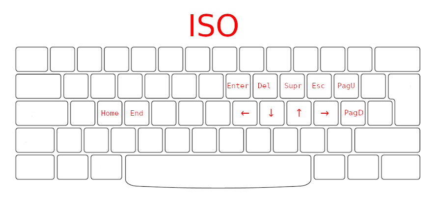

# Comand center

The following documents contain keyboard shortcuts that are configured manually.
In addition, the added functions to enable the terminal are listed.

## Keybinds

A custom layout has been defined for interaction with i3, vscode, and tmux.
The keyboard shortcuts were configured so that it can be used when possible.

- [i3wm keybinds](./i3wm_keybinds.md)
- [VSCode keybinds](./vscode_keybinds.md)
- [tmux keybinds](./tmux_keybinds.md)

## Terminal functions

- [Terminal functions](./terminal_functions.md)
